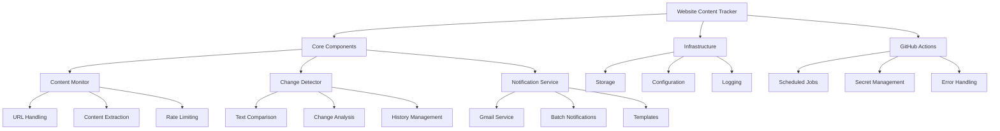

# Website Content Tracker Design

## System Overview



## Architecture Details

### 1. Project Structure
```
website_tracker/
├── src/
│   ├── monitor/
│   │   ├── __init__.py
│   │   ├── content_fetcher.py      # Handles website content retrieval
│   │   └── rate_limiter.py         # Manages request rates
│   ├── detector/
│   │   ├── __init__.py
│   │   ├── text_extractor.py       # Extracts relevant text content
│   │   ├── diff_analyzer.py        # Analyzes text differences
│   │   └── history_manager.py      # Manages content history
│   ├── notification/
│   │   ├── __init__.py
│   │   ├── gmail_service.py        # Gmail integration
│   │   └── templates/              # Email templates
│   └── utils/
│       ├── __init__.py
│       ├── config.py               # Configuration management
│       └── logger.py               # Logging utilities
├── tests/
├── config/
│   ├── websites.yml                # Website configurations
│   └── email_templates/            # Email template files
└── .github/workflows/
    └── monitor.yml                 # GitHub Actions workflow
```

### 2. Key Components

#### Content Monitor
- Uses BeautifulSoup for HTML parsing
- Extracts text content from specified HTML elements
- Implements retry logic and error handling
- Rate limiting to prevent overloading websites

#### Change Detector
- Text-based difference detection
- Configurable change thresholds
- Historical tracking of changes
- Efficient storage of text content

#### Notification Service
- Gmail API integration
- Batch notifications for multiple changes
- Customizable email templates
- Rate limiting for email sending

### 3. Configuration (websites.yml)

```yaml
websites:
  - name: "Job Board 1"
    url: "https://example.com/jobs"
    frequency: "hourly"  # hourly, daily, weekly
    content:
      selectors:
        - ".job-listing"    # CSS selector for job listings
        - ".vacancy-info"   # CSS selector for vacancy details
      exclude:
        - ".advertisement"  # Elements to ignore
    notification:
      threshold: 
        added: 1      # Notify if at least 1 new item
        removed: 1    # Notify if at least 1 item removed
        changed: 0.3  # 30% content change threshold
      batch: true     # Combine notifications
      email:
        to: ["user@example.com"]

email:
  service: "gmail"
  credentials:
    client_id: "${GMAIL_CLIENT_ID}"
    client_secret: "${GMAIL_CLIENT_SECRET}"
    refresh_token: "${GMAIL_REFRESH_TOKEN}"
  from: "your-email@gmail.com"
  batch_interval: 3600  # Seconds between batch sends
  rate_limit: 
    max_emails: 50
    period: 3600    # Per hour
```

### 4. GitHub Actions Workflow

```yaml
name: Website Content Monitor
on:
  schedule:
    - cron: '*/30 * * * *'  # Run every 30 minutes
  workflow_dispatch:  # Manual trigger

jobs:
  monitor:
    runs-on: ubuntu-latest
    steps:
      - uses: actions/checkout@v3
      - name: Set up Python
        uses: actions/setup-python@v4
        with:
          python-version: '3.11'
      - name: Install dependencies
        run: |
          python -m pip install --upgrade pip
          pip install -r requirements.txt
      - name: Run monitor
        env:
          GMAIL_CLIENT_ID: ${{ secrets.GMAIL_CLIENT_ID }}
          GMAIL_CLIENT_SECRET: ${{ secrets.GMAIL_CLIENT_SECRET }}
          GMAIL_REFRESH_TOKEN: ${{ secrets.GMAIL_REFRESH_TOKEN }}
        run: python -m src.monitor

concurrency:
  group: ${{ github.workflow }}-${{ github.ref }}
  cancel-in-progress: false  # Ensure monitoring completes
```

## Implementation Phases

### Phase 1: Core Setup (Week 1)
- Project structure setup
- Basic dependencies
- Configuration management
- Logging system

### Phase 2: Content Monitoring (Week 2)
- Website content fetcher
- Text extraction
- Rate limiting
- Basic storage

### Phase 3: Change Detection (Week 2-3)
- Text comparison logic
- Change threshold implementation
- History management
- Storage optimization

### Phase 4: Notification System (Week 3)
- Gmail API integration
- Email templates
- Batch notification logic
- Rate limiting

### Phase 5: GitHub Actions (Week 4)
- Workflow setup
- Scheduling configuration
- Secret management
- Error reporting

### Phase 6: Testing & Optimization (Week 4-5)
- Unit tests
- Integration tests
- Performance optimization
- Documentation

## Technical Considerations

### Scalability
- Efficient text storage and comparison
- Batch processing for notifications
- Rate limiting for both website fetching and notifications
- Resource-efficient GitHub Actions usage

### Reliability
- Retry logic for failed requests
- Error handling and reporting
- Backup notification mechanisms
- Transaction-like operations for state changes

### Maintainability
- Clear code structure
- Comprehensive logging
- Easy configuration updates
- Automated testing

### Storage Efficiency
- Text-only storage
- Compression for historical data
- Regular cleanup of old data
- Efficient difference storage

## Required Dependencies
```
requests>=2.31.0
beautifulsoup4>=4.12.0
google-auth>=2.27.0
google-auth-oauthlib>=1.2.0
google-auth-httplib2>=0.2.0
google-api-python-client>=2.120.0
pyyaml>=6.0.1
python-dotenv>=1.0.0
tenacity>=8.2.3